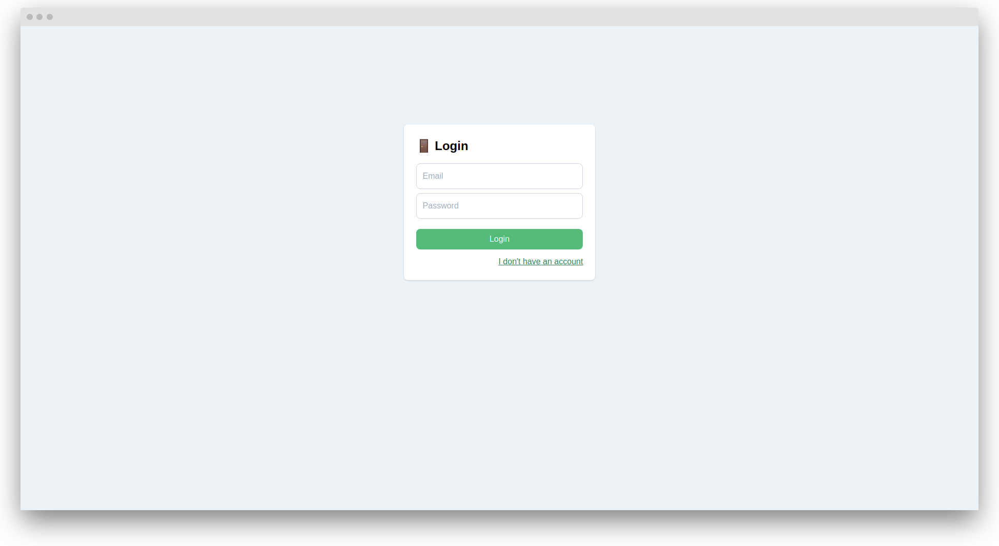
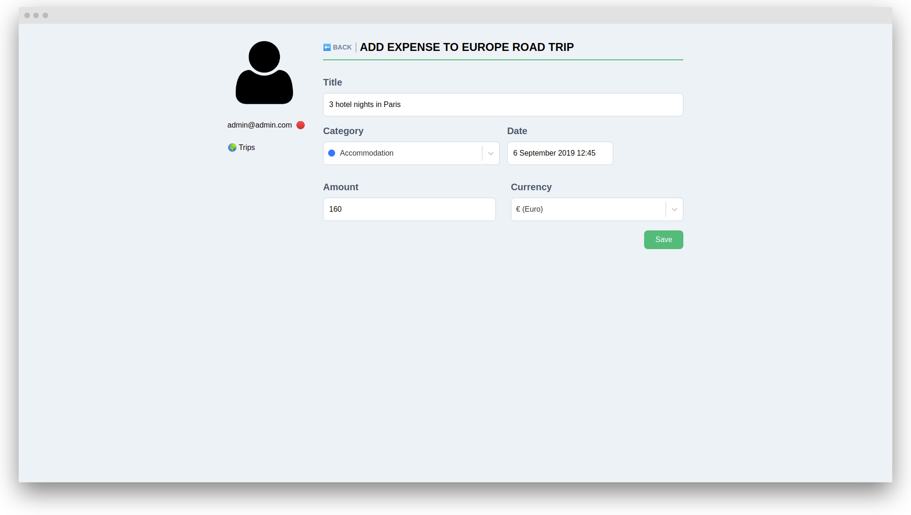

<h1 align="center">:airplane: Travel Expense Manager :money_with_wings:</h1>

<p align="center">A travel expense manager made with Django, GraphQL, Next.js and Tailwind CSS</p>

<p align="center">
    <a href="https://github.com/vreaxe/travel-expense-manager/releases"></a>
    <a href="https://github.com/vreaxe/travel-expense-manager/blob/master/TODO.md"></a>
    <a href="https://github.com/vreaxe/travel-expense-manager/blob/master/LICENSE.md"></a>
</p>

&nbsp;

> **:warning: Warning**: WIP. Do not use in a production environment.

## Development environment installation

### :whale: With Docker

**1. Download or clone repo**

```
git clone https://github.com/vreaxe/travel-expense-manager.git
```

**2. Build and run Docker containers**

```
docker-compose -f docker-compose.dev.yml up -d --build
```

**3. Create the .env files inside the backend and clients directories and change environment variables**

Backend:

```
DEBUG=True

SECRET_KEY=something

GRAPHIQL=True

DB_NAME=travel_expense_manager
DB_USER=root
DB_PASSWORD=secret
DB_HOST=database
DB_PORT=3306

CORS_ORIGIN_WHITELIST=http://127.0.0.1,http://localhost
```

Frontend:

```
NODE_ENV=local

GRAPHQL_URL_CLIENT_SIDE=http://localhost:8000/graphql/
GRAPHQL_URL_SERVER_SIDE=http://backend:8000/graphql/

APP_NAME=Travel Expense Manager
```

**4. Migrate**

```
docker exec -it tem-dev-backend /bin/bash
python manage.py migrate
```

**5. Create a superuser**

```
docker exec -it tem-dev-backend /bin/bash
python manage.py createsuperuser
```

**6. Now you can access the backend at http://localhost:8000 and the frontend at http://localhost:3000**

**7. Sync currencies and countries (optional - you can create them manually through the Django admin panel)**

```
docker exec -it tem-dev-backend /bin/bash
python manage.py sync_countries
python manage.py sync_currencies
```

&nbsp;

## Screenshots






